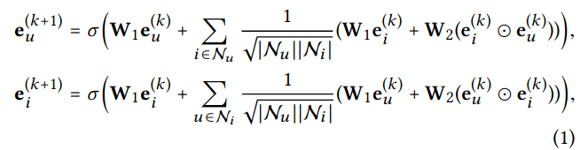
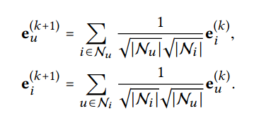

# PMLDL assignment 2 - Movies recomendation system. Report

## Sergeev Nikita BS20-AI n.sergeev@innopolis.university

---

## Introduction:
The main task of this assigment is to build a recommendation system for movies. The dataset used is MovieLens 100K. The dataset contains 100,000 ratings from ~1000 users on ~1700 movies. Dataset can be devided into 3 parts:
* u.data - contains all ratings
* u.item - contains information about movies
* u.user - contains information about users
The main information for building a recommendation system is u.data. It contains user id, movie id, rating and timestamp. The rating is in range from 1 to 5. The timestamp is in unix seconds. 

## Data exploration:
The first step of data exploration is to load it in the appropriate way. In this step I loaded the data using pandas and removed useless features from the data(like timestamp, video release date, etc.). One more step here is to map genres to their names, as initially they are represented as binary values.  

The next step i did is to check the distribution of ratings.

As we can see from the plot below, the most common rating is 4.0. The distribution is not uniform, but it is not a problem, as we are not going to predict the rating, but to recommend movies.

I also checked the distribution different genres in the dataset.

As we can see, the most common genres are Drama, Comedy and Action.

Another thing I checked is the distribution of movies popularity. Popilarity of the movie is defined simply as the number of ratings it has.

From the plot above it's easy to see that the most of the movies have less than 100 ratings.

And the last thing I would like to mention is the distribution of users activity. User activity is defined as the number of ratings he has given.

As we can see, the most of the users have rated less than 100 movies.

## Model implementation:

For this task I implemented 2 models:

* Predict missing ratings using matrix factorization. In my case I used SVD algorithm.
* Use Graph Neural Network to predict the rating of the movie for the user.

#### Matrix factorization:

This approach is pretty straightforward. In the first step we build a user2item matrix which looks like this:

|        | item_1 | item_2 | item_3 | ... | item_n |
|--------|--------|--------|--------|-----|--------|
| user_1 | 5      | 4      | 0      | ... | 3      |
| user_2 | 0      | 0      | 3      | ... | 0      |
| user_3 | 0      | 5      | 0      | ... | 0      |
| ...    | ...    | ...    | ...    | ... | ...    |
| user_m | 0      | 0      | 0      | ... | 1      |

Raws of this matrix are users, columns are items. The values in the matrix are ratings. As we can see, the matrix is very sparse, as most of the users have rated only a few movies. 

Next this matrix is factorized using SVD algorithm. And as the result after SVD we get the filled matrix, where the missing values are filled with the predicted ratings. The process of factorization is described in training process section.

In this algo I taken top 100 movies with the highest predicted rating and recommended them to the user. With this setup I got the following results, varying the number of singular values:

| K   | intersections | rmse            |
|-----|---------------|-----------------|
| 8   | 1.69459172853 | 0.98045045859   |
| 10  | 1.67126193001 | 0.979928654979  |
| 12  | 1.62354188759 | 0.979406993207  |
| 14  | 1.73276776246 | 0.97981678108   |
| 17  | 1.65959703075 | 0.981769152389  |
| 943 | 1.62884411453 | 1.0261583429    |

As we can see, the best results are achieved with k = 12. The number of intersections is the number of movies that are in both the test set and the recommended set. The rmse is the root mean squared error between the predicted ratings and the real ratings. The rmse is calculated only for the test set. The rmse is calculated using the following formula:

$$\sqrt{\frac{\sum_{i=1}^{n}(y_i - \hat{y_i})^2}{n}}$$

Where $y_i$ is the real rating, $\hat{y_i}$ is the predicted rating, n is the number of ratings in the test set.

#### LightGCN:
This approach is pretty the same as used in the lab, but with some modifications in model architecture and evaluation process. 

The model used in this approach is Graph Convolutional Network, adopted for the recommendation system. It's was presented in the paper [LightGCN: Simplifying and Powering Graph Convolution Network for Recommendation](https://arxiv.org/pdf/2002.02126.pdf). 

This method using the data in the following way: each user is a node in the graph, each movie is a node in the graph. The edges in the graph are the scores given by the user to the movie. The score is the weight of the edge. The model is trained to predict the score of the edge between the user and the movie. 

Main idea of this model is to modify the way of getting embeddings of the nodes and users. In the original GCN the embeddings of the nodes are calculated using the following formula:

$e_u^{k+1}$ and $e_i^{k+1}$ here are the embeddings of the user and the item in the k+1 layer. $\mathcal{N}_u$ and $\mathcal{N}_i$ are sets of neighbors of the user u and item i. And $W_1$ and $W_2$ are weight matrices, which are learned during the training process.

And in the LightGCN the embeddings are calculated using the following formula:

As you you can see, authors of the paper removed the weight matrices from the formula. They argue that in case of the recommendation system the weight matrices are not needed, as we don't have any features of the nodes, we only have user_id, item_id and the score. So, the weight matrices are not needed.

And the only trainable parameters ramains in this model are the embeddings at the 0-th layer($e_u^0$ and $e_i^0$).

Final embeddings of the user and the item are calculated as the average of the embeddings at all layers:

$$
e_u = \frac{1}{K+1}\sum_{k=0}^{K}e_u^k
$$

$$
e_i = \frac{1}{K+1}\sum_{k=0}^{K}e_i^k
$$

After all of this manipulations we can calculate the score of the edge between the user and the item using the following formula:

$$
\hat{y}_{ui} = e_u^Te_i
$$

## Models advantages and disadvantages:

#### Matrix factorization:
**Advantages**:
* **Easy to understand** - SVD provides interpretable factors (latent features) that represent user preferences and item attributes. This transparency can be beneficial in understanding why certain recommendations are made.
* **Easy to train** - SVD is a relatively simple algorithm to implement.

**Disadvantages**:
* **Can't handle cold start problem** - SVD faces challenges when dealing with new users or items (the cold start problem) as it relies heavily on historical interactions to make predictions.
* **Scalability Issues for Large Datasets** - While SVD is efficient for raletevely small datasets, it might struggle with larger datasets due to its computational complexity, especially with very sparse matrices.

#### LightGCN:
**Advantages**:
* **Efficiency** - It requires fewer parameters and computations compared to traditional GCNs, which can lead to faster training and inference times.
* **Good Performance** - LightGCN has shown better performance compared to SVD.

**Disadvantages**:
* **Cold start problem** - LightGCN is not able to handle the cold start problem, as it does not use any side information about the users or items.
* **Lack of Personalization** - LightGCN might not capture nuanced user preferences or item features as well as more intricate models, leading to less personalized recommendations.

Both models have their own advantages and disadvantages. 

The main advantage of the LightGCN is it's efficiency. It's performs better then SVD. 

In the same time, SVD is easier to understand and to train. It's also more interpretable, as it provides latent features, that represent user preferences and item attributes.

## Training process:

#### Matrix factorization:

Matrix factorization is done using the following algorithm:

1) Fill the values in the initial sparse matrix with the masked values
2) Fill the masked values with the mean of the column, which is mean rating of the movie. And then subtract the mean from all the elements of the matrix. This is done to make matrix elements have zero mean. (Centering the matrix)
3) Perform **SVD** on the matrix. By this step we get 3 matrices: U, S, V. U is a matrix of left singular vectors, S is a diagonal matrix of singular values, V is a matrix of right singular vectors.
4) Leave only k first singular values and vectors. This is done to reduce the dimensionality of the matrix. k in this case is a hyperparameter. The dimensionality of s is k x k after the reduction. The dimensionality of U is m x k, the dimensionality of V is n x k. So, the dimensionality of the resulting matrix stays the same.
5) We can reconstruct the initial matrix using the following formula: 
   
$$U\sqrt{S} \times \sqrt{S}V^T$$

6) And tis resulting matrix is the matrix of predicted ratings. The last step is to add mean values back to the matrix.

With this approach we can recommend movies to the user by simply sorting the movies by the predicted rating.

#### LightGCN:
